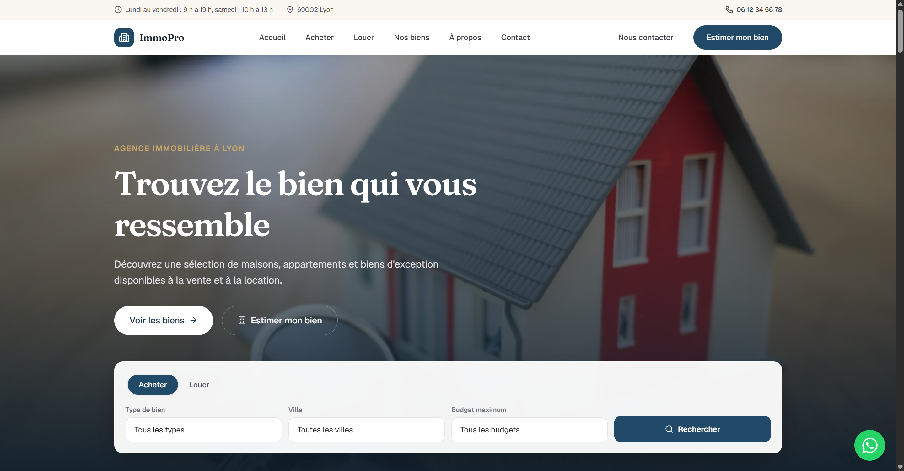

# ImmoPro



Site vitrine moderne pour agences immobilières, agents indépendants, promoteurs, chasseurs immobiliers et petites structures du secteur.

ImmoPro permet de **présenter l'agence**, **afficher les biens disponibles**, **filtrer les annonces**, **mettre en avant des biens**, **générer des demandes de visite** et **récupérer des prospects** vendeurs et acheteurs, avec un contact facilité par téléphone et WhatsApp.

Le parcours proposé est le suivant : **découvrir les biens → filtrer → consulter un bien → demander une visite → contacter l'agence.**

## Stack technique

- Next.js 16 (App Router, React 19, TypeScript strict)
- Tailwind CSS v4, configuré en CSS-first dans `app/globals.css` (pas de `tailwind.config.js`)
- `lucide-react` pour les icônes
- `next/image` pour les images optimisées (Unsplash)
- `next/font` pour les polices Google (Geist + Fraunces)
- SEO intégré : metadata dynamiques, `app/sitemap.ts`, `app/robots.ts` et données structurées Schema.org (`RealEstateAgent`, `Offer`)

## Prérequis

Node.js 20+ et npm installés.

## Récupérer le projet

Le template est publié dans le dépôt GitHub [templates-web](https://github.com/neylorxt/templates-web), qui regroupe tous les templates. Clonez le dépôt, puis placez-vous dans le dossier du template :

```bash
git clone https://github.com/neylorxt/templates-web.git
cd templates-web/immo-pro
```

Vous pouvez aussi télécharger l'archive ZIP du dépôt depuis GitHub, la décompresser, puis ouvrir un terminal dans le dossier `immo-pro`.

## Installation

Installez les dépendances, puis lancez le serveur de développement :

```bash
npm install
npm run dev
```

Ouvrez http://localhost:3000 dans votre navigateur. Le serveur de développement utilise Turbopack et se recharge automatiquement à chaque modification de code. Pour adapter le site à votre agence, suivez la section « Personnaliser le site » ci-dessous.

## Personnaliser le site

Toutes les données importantes sont centralisées dans des fichiers simples à modifier.

### Identité et coordonnées

Les coordonnées de l'agence, le numéro WhatsApp, le téléphone, l'adresse, les horaires, les statistiques, les réseaux sociaux et la navigation sont centralisés dans `config/site.ts`. Le numéro WhatsApp est utilisé partout (bouton flottant, cartes de bien, pages de détail) : changez-le une seule fois ici.

### Les biens

Le catalogue est centralisé dans `data/properties.ts`. Chaque bien définit son titre, sa description, son type (vente ou location), son type de bien (appartement, maison, villa, terrain, bureau, commerce), son prix, sa ville, sa surface, ses pièces, ses photos, ses badges et ses équipements. La page « Nos biens », les filtres, les pages de détail et le sitemap se mettent à jour automatiquement.

Les photos proviennent d'Unsplash. Remplacez les URL par les photos du client.

### Avis clients

Les témoignages et la note globale sont centralisés dans `data/testimonials.ts`.

### Services

Les services de l'agence (achat, vente, location, estimation…) sont centralisés dans `data/services.ts`.

### Identité visuelle

La couleur de marque se règle dans `app/globals.css` via les variables `--color-brand-*`. Un accent doré (`--color-gold-*`) est réservé aux touches premium (badges, prix, points forts). Les polices se configurent dans `app/layout.tsx`.

## Vérifications

```bash
npm run lint
npx tsc --noEmit
npm run build
```

## Déploiement

Le site peut être déployé sur Vercel, Netlify ou tout service compatible Next.js.

## Ressources

- [Documentation Next.js App Router](https://nextjs.org/docs)
- [Lucide React](https://lucide.dev)
- [Unsplash](https://unsplash.com)