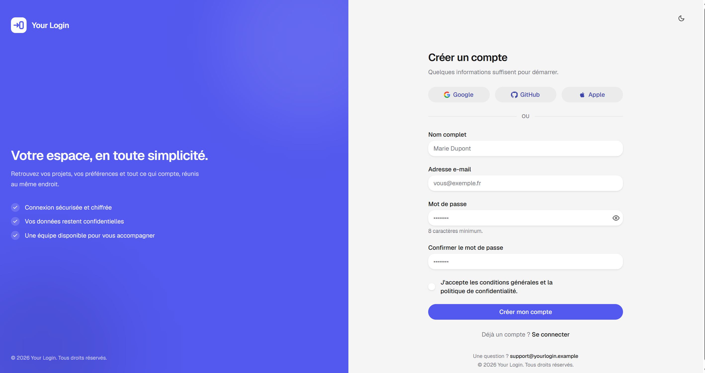

# LoginPage



Template Next.js de pages d'authentification, conçu pour être adapté rapidement à un produit ou un service : page de connexion, page d'inscription et connexion sociale (Google, GitHub, Apple).

Tout le contenu visible est en français et la démo fournie utilise une marque fictive, « Your Login ». Les formulaires, la validation, les notifications et le thème clair ou sombre fonctionnent sans backend ; les points d'intégration sont signalés par des commentaires `TODO`.

## Démo incluse

- `/login` : connexion par e-mail et mot de passe, mot de passe affichable, case « Se souvenir de moi », lien de mot de passe oublié.
- `/register` : inscription avec nom complet, e-mail, mot de passe et confirmation, acceptation des conditions.
- Boutons de connexion sociale Google, GitHub et Apple, prêts à brancher sur un fournisseur OAuth.
- Bascule de thème clair ou sombre et notifications de succès.

La racine `/` redirige vers `/login`.

## Stack technique

- Next.js 16 (App Router, React 19, TypeScript strict)
- HeroUI v3 (`@heroui/react`, `@heroui/styles`), composants composés et thème géré par `useTheme`
- Tailwind CSS v4, configuré en CSS-first dans `app/globals.css` (pas de `tailwind.config.js`)
- `next/font` pour les polices Google (Geist + Geist Mono)
- Aucune dépendance de formulaire ni de validation : tout est géré côté client

## Démarrage rapide

Le template est publié dans le dépôt GitHub [templates-web](https://github.com/neylorxt/templates-web), qui regroupe tous les templates. Clonez le dépôt, puis placez-vous dans le dossier du template :

```bash
git clone https://github.com/neylorxt/templates-web.git
cd templates-web/login-page
```

Installez ensuite les dépendances, puis lancez le serveur de développement :

```bash
npm install
npm run dev
```

Ouvrez `http://localhost:3000` dans votre navigateur. Le serveur de développement utilise Turbopack et se recharge automatiquement à chaque modification.

## Personnaliser le template

Toutes les données de la marque sont centralisées dans **`config/site.ts`** : ne jamais écrire ces valeurs en dur dans les composants.

| Clé | Description |
| --- | --- |
| `name` | Nom de la marque affiché dans l'en-tête et le panneau latéral |
| `tagline`, `description` | Accroche et texte du panneau latéral |
| `highlights` | Points forts listés sur le panneau latéral |
| `supportEmail` | Adresse de contact affichée en pied de page |
| `legal.termsUrl`, `legal.privacyUrl` | Liens vers vos conditions générales et votre politique de confidentialité |

L'identité visuelle se règle dans `app/globals.css` via les variables `--accent` et `--accent-foreground` (une valeur pour le thème clair, une pour le thème sombre), ainsi que `--radius` pour l'arrondi global.

Les pages et composants concernés :

- `app/(auth)/layout.tsx` : structure commune (panneau de marque, en-tête, pied de page).
- `app/(auth)/login/page.tsx` et `app/(auth)/register/page.tsx` : contenu des deux pages.
- `components/LoginForm.tsx` et `components/RegisterForm.tsx` : formulaires et validation.
- `components/SocialAuthButtons.tsx` : boutons de connexion sociale.
- `components/BrandPanel.tsx` : panneau latéral, masqué sous le palier `lg`.
- `components/icons.tsx` : icônes SVG (marques et interface).

## Brancher l'authentification

Le template fonctionne sans backend : chaque formulaire simule un délai puis affiche une notification de succès. Pour aller plus loin, remplacez les commentaires `TODO` :

- `components/LoginForm.tsx` (`handleSubmit`) : appelez votre fournisseur d'authentification (NextAuth, Clerk, Supabase, une API…).
- `components/RegisterForm.tsx` (`handleSubmit`) : appelez votre API d'inscription (route handler, Server Action…).
- `components/SocialAuthButtons.tsx` (`onPress`) : déclenchez la redirection OAuth de votre fournisseur.

## Architecture

```
config/site.ts                 identité de la marque (source unique)
app/
  layout.tsx                   polices Geist, lang="fr", metadata, notifications
  page.tsx                     redirection vers /login
  globals.css                  thème Tailwind v4, couleur d'accent, rayon
  (auth)/layout.tsx            shell commun (panneau de marque, en-tête, pied de page)
  (auth)/login/page.tsx        page de connexion
  (auth)/register/page.tsx     page d'inscription
components/
  BrandPanel.tsx               panneau latéral de marque (masqué sous lg)
  LoginForm.tsx                formulaire de connexion
  RegisterForm.tsx             formulaire d'inscription
  SocialAuthButtons.tsx        boutons Google, GitHub et Apple
  ThemeToggle.tsx              bascule clair ou sombre (localStorage heroui-theme)
  icons.tsx                    icônes SVG (marque et interface)
```

## Vérification

```bash
npm run lint       # eslint
npx tsc --noEmit   # typecheck (pas de script dédié)
npm run build      # build de production
```

## Déploiement

Le site peut être déployé sur Vercel, Netlify ou tout service compatible Next.js.

## Notes

- **HeroUI v3, pas v2** : composants composés (`Card.Header`), `onPress` plutôt que `onClick`, aucun provider à installer. Consulter la documentation avant d'écrire un composant.
- `resolvedTheme` de `useTheme` vaut `undefined` au rendu serveur : prévoir ce cas dans les composants qui l'utilisent.
- L'eslint interdit l'apostrophe droite dans le texte JSX : écrire `&apos;`.
- Dans la prose française, ne pas employer le trait d'union comme séparateur ; le réserver aux noms composés et identifiants.
- Les liens de démonstration (conditions générales, politique de confidentialité, mot de passe oublié) pointent vers `#` ou `config/site.ts` : les remplacer par de vraies pages avant mise en ligne.

## Ressources

- [Documentation Next.js App Router](https://nextjs.org/docs)
- [Documentation HeroUI v3](https://heroui.com/docs/react)
