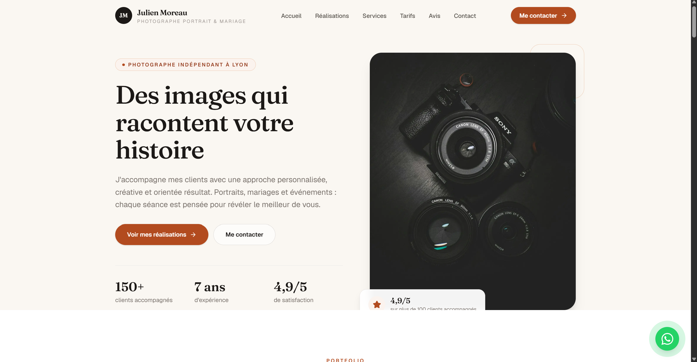

# ShowcasePro



Template Next.js de site vitrine professionnel, conçu pour être adapté rapidement à un prestataire : photographe, barber, coach, freelance, créateur, petite agence ou consultant.

Site monopage en français, pensé pour : **montrer les réalisations → rassurer → présenter les services et tarifs → obtenir une prise de contact ou une réservation.**

## Démo incluse

Le template est fourni avec le profil d'un photographe portrait et mariage (Julien Moreau, à Lyon). Tout le contenu est réel et crédible, prêt à être remplacé par vos données.

## Prérequis

Node.js 20+ et npm installés.

## Récupérer le projet

Le template est publié dans le dépôt GitHub [templates-web](https://github.com/neylorxt/templates-web), qui regroupe tous les templates. Clonez le dépôt, puis placez-vous dans le dossier du template :

```bash
git clone https://github.com/neylorxt/templates-web.git
cd templates-web/showcase-pro
```

Vous pouvez aussi télécharger l'archive ZIP du dépôt depuis GitHub, la décompresser, puis ouvrir un terminal dans le dossier `showcase-pro`.

## Installation

Installez les dépendances, puis lancez le serveur de développement :

```bash
npm install
npm run dev
```

Ouvrez http://localhost:3000 dans votre navigateur. Le serveur de développement utilise Turbopack et se recharge automatiquement à chaque modification de code. Pour adapter le site à un prestataire, suivez la section « Personnaliser le template » ci-dessous.

## Personnaliser le template

Toutes les données du site sont centralisées dans `config/site.ts` :

| Clé | Description |
| --- | --- |
| `name`, `profession` | Nom et métier affiché |
| `headline`, `description` | Titre et sous-titre du hero |
| `contact` | Téléphone, WhatsApp, email, ville |
| `socials` | Liens réseaux sociaux |
| `booking` | Lien de réservation (Calendly, Planity, Booksy…) |
| `trust`, `stats` | Chiffres clés du hero et de la section À propos |

Le contenu des sections vitrines est dans `data/` :

- `projects.ts` — réalisations et catégories filtrées
- `services.ts` — prestations (icônes Lucide, bénéfices)
- `pricing.ts` — formules et tarifs
- `testimonials.ts` — avis clients
- `process.ts` — étapes du processus

L'identité visuelle (couleur de marque, polices) se règle dans `app/globals.css` via les variables `--color-brand-*` et `--font-*`.

Le numéro WhatsApp du bouton flottant et le message pré-rempli proviennent de `config/site.ts` (`contact.whatsapp` et `whatsappMessage`).

## Connecter le formulaire de contact

Par défaut, le formulaire envoie une requête vers `/api/contact` et fonctionne sans service externe. Pour transmettre les demandes à un vrai service, définissez la variable d'environnement :

```bash
CONTACT_WEBHOOK_URL=https://exemple.com/webhook
```

Chaque demande sera alors transmise en POST à cette URL. Voir `app/api/contact/route.ts`.

## Vérifications

```bash
npm run lint
npx tsc --noEmit
npm run build
```

## Déploiement

Le site peut être déployé sur Vercel, Netlify ou tout service compatible Next.js.

## Ressources

- [Documentation Next.js App Router](https://nextjs.org/docs)
- [Lucide React](https://lucide.dev)