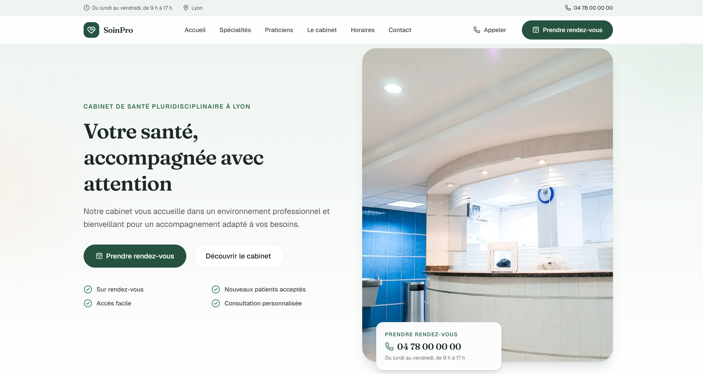

# SoinPro



Template Next.js monopage pour un professionnel de santé ou un petit cabinet : dentiste, kinésithérapeute, psychologue, nutritionniste, ostéopathe ou cabinet pluridisciplinaire. Un site vitrine complet, en français, sobre et rassurant, avec prise de rendez-vous en ligne, par téléphone ou par formulaire.

Le repo est fourni avec un exemple de démonstration : « SoinPro », un cabinet de santé pluridisciplinaire à Lyon (soins dentaires, kinésithérapie, psychologie, nutrition, ostéopathie).

## Stack technique

- Next.js 16 (App Router, React 19, TypeScript strict)
- Tailwind CSS v4, configuré en CSS-first dans `app/globals.css` (pas de `tailwind.config.js`)
- `lucide-react` pour les icônes
- `next/image` pour les images optimisées (Unsplash / Pexels)
- `next/font` pour les polices Google (Geist + Fraunces)

## Démarrage rapide

Le template est publié dans le dépôt GitHub [templates-web](https://github.com/neylorxt/templates-web), qui regroupe tous les templates. Clonez le dépôt, puis placez-vous dans le dossier du template :

```bash
git clone https://github.com/neylorxt/templates-web.git
cd templates-web/soin-pro
```

Installez ensuite les dépendances, puis lancez le serveur de développement :

```bash
npm install
npm run dev
```

Ouvrez `http://localhost:3000` dans votre navigateur. Le serveur de développement utilise Turbopack et se recharge automatiquement à chaque modification. Pour adapter le site à un professionnel, suivez la section « Personnaliser pour un client » ci-dessous.

## Personnaliser pour un client

Toutes les données du site vivent dans des fichiers simples : **`config/site.ts`** (source unique pour l'identité et les coordonnées) et les fichiers de **`data/`**. Ne jamais écrire ces valeurs en dur dans les composants.

### Fichiers à modifier

| Donnée | Fichier |
| --- | --- |
| Nom, profession, coordonnées, WhatsApp, réseaux sociaux | `config/site.ts` |
| Prise de rendez-vous en ligne (Doctolib, Calendly…) | `booking.url` dans `config/site.ts` |
| Horaires d'ouverture, horaires téléphoniques, fermeture exceptionnelle | `hours`, `phoneHours`, `exceptionalClosure` dans `config/site.ts` |
| Bloc urgences (à adapter au pays du client) | `emergency` dans `config/site.ts` |
| Images du hero, du cabinet et du CTA final | `images` dans `config/site.ts` |
| Spécialités et cartes « En savoir plus » | `data/specialties.ts` |
| Praticiens (une seule fiche suffit pour un professionnel seul) | `data/practitioners.ts` |
| Déroulement d'une consultation | `data/process.ts` |
| Avis clients | `data/testimonials.ts` |
| Informations pratiques (paiement, documents, langues…) | `data/practicalInfo.ts` |

### Adapter au métier du client

- **Dentiste** : spécialités « Consultation générale, Détartrage, Soins, Prothèses, Esthétique, Urgences », type Schema.org `Dentist`.
- **Kinésithérapeute** : spécialités « Rééducation, Kinésithérapie du sport, Douleurs articulaires, Post-opératoire, Mobilité, Prévention », type `Physician` ou `MedicalClinic`.
- **Psychologue** : spécialités « Consultation individuelle, Gestion du stress, Anxiété, Accompagnement émotionnel, Thérapie de couple, Consultation en ligne », type `MedicalClinic` ou `LocalBusiness`.
- **Nutritionniste** : spécialités centrées alimentation, type `MedicalClinic` ou `LocalBusiness`.
- **Ostéopathe** : spécialités « Douleurs du dos, Tensions, Prévention… », type `MedicalClinic` ou `LocalBusiness`.

Le type Schema.org se règle dans `siteConfig.schemaType` (`config/site.ts`). Ne pas appliquer un type médical inadapté à la profession.

### Prise de rendez-vous

Trois options combinables dans `config/site.ts` :

- **En ligne** : `booking.online = true` + `booking.url` (Doctolib, Calendly, autre plateforme).
- **Par téléphone** : `booking.phone = true` (bouton d'appel vers `phone`).
- **Formulaire** : `booking.form = true` (champs nom, prénom, email, téléphone, motif, message ; aucun détail médical demandé).

WhatsApp est facultatif : à activer uniquement si le cabinet l'utilise, via `useWhatsApp`.

### Avis clients

Les avis du template sont **fictifs et clairement annoncés comme démonstration** dans la page. Avant toute mise en ligne :

- remplacer les avis par de vrais avis autorisés par les patients, ou
- masquer la section avec `showTestimonials = false` dans `data/testimonials.ts`.

### Images

- Utiliser uniquement des photos réelles d'Unsplash ou Pexels, cohérentes et non choquantes.
- `next.config.ts` déclare les domaines distants : ne pas les retirer, sinon `next/image` casse.
- Toujours fournir un `alt` (SEO et accessibilité).

### Couleurs et typographie

La marque se règle dans `app/globals.css`, dans le bloc `@theme` : vert sauge de marque (`--color-brand-*`), accent chaleureux (`--color-clay-*`), fonds crème / brume (`--color-cream`, `--color-mist`), encre (`--color-ink`). Les polices (Geist + Fraunces) se changent dans `app/layout.tsx` via `next/font`.

### Informations administratives

Ne pas inventer d'informations administratives : remboursements, conventions, documents ou numéros de secours ne doivent être renseignés que lorsque le professionnel les a confirmés.

## Architecture

```
config/site.ts              données personnalisables (source unique)
data/
  specialties.ts            spécialités (cartes + détails)
  practitioners.ts          praticiens (bio, langues, photo)
  testimonials.ts           avis de démonstration (section masquable)
  process.ts                déroulement d'une consultation
  practicalInfo.ts          informations pratiques
lib/hours.ts                calcul ouvert / fermé (fuseau Europe/Paris)
app/
  layout.tsx                polices, lang="fr", metadata, JSON-LD Schema.org
  page.tsx                  composition des sections
  globals.css               thème Tailwind v4 et variables de marque
  sitemap.ts, robots.ts     SEO
  api/contact/route.ts      réception des formulaires (webhook optionnel)
  mentions-legales/         mentions légales
  politique-de-confidentialite/  politique de confidentialité
components/
  Header.tsx                navbar sticky + menu mobile
  Hero.tsx                  titre, CTA, points de confiance, photo
  Specialties.tsx           cartes de spécialités (détails repliables)
  Practitioners.tsx         grille des praticiens
  PractitionerCard.tsx      fiche praticien avec bio repliable
  About.tsx                 philosophie du cabinet, avantages, stats
  ConsultationProcess.tsx   déroulement en 4 étapes
  Testimonials.tsx          avis + note globale + bandeau démo
  OpeningHours.tsx          horaires + indicateur ouvert / fermé
  Booking.tsx               prise de rendez-vous (en ligne / téléphone / formulaire)
  ContactForm.tsx           formulaire simple (aucun détail médical)
  Contact.tsx               coordonnées et formulaire
  Location.tsx              carte OpenStreetMap + accès + itinéraire
  PracticalInfo.tsx         informations pratiques
  EmergencyNotice.tsx       rappel sur les urgences
  CtaFinal.tsx              section finale de prise de rendez-vous
  Footer.tsx                pied de page, mentions, copyright dynamique
  MobileActionBar.tsx       barre mobile fixe Appeler / Prendre rendez-vous
  WhatsAppButton.tsx        bouton flottant (optionnel)
  icons.tsx                 icônes de marque (WhatsApp, réseaux) en SVG
```

## Vérification

```bash
npm run lint       # eslint
npx tsc --noEmit   # typecheck (pas de script dédié)
npm run build      # build de production
```

## Notes

- En `lucide-react` v1, les icônes de marque (WhatsApp, Facebook, Instagram, LinkedIn) ne sont plus exportées : elles sont en SVG inline dans `components/icons.tsx`.
- L'eslint interdit l'apostrophe droite dans le texte JSX : écrire `&apos;`.
- Dans la prose française, ne pas employer le trait d'union comme séparateur ; le réserver aux noms composés et identifiants.
- Ce site est une vitrine et un outil de prise de contact et de rendez-vous, pas un logiciel médical : il ne collecte aucune donnée de santé et ne fournit aucun diagnostic.
- Les consignes pour les agents IA sont dans `AGENTS.md` (bloc géré par `next dev` à conserver).